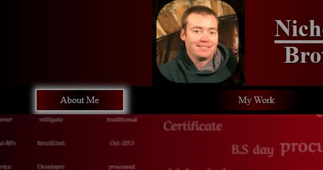
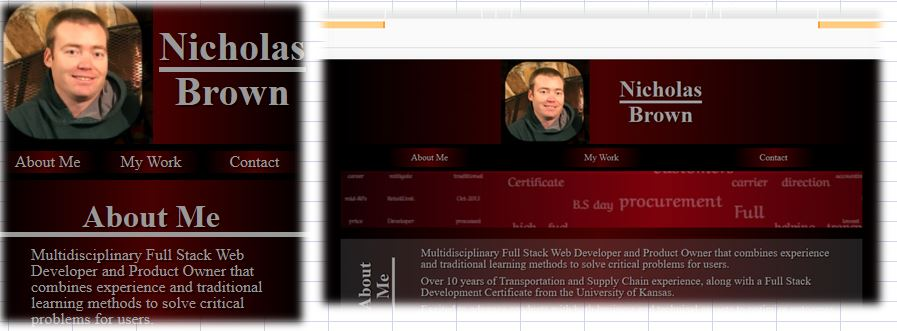

# Nicholas Brown Portfolio - React

## Link to Portfolio

https://brownnicholasj.github.io/nbrown_portfolio/

## Description

This portfolio page is to serve as a repository to showcase my work for both
personal and professional projects.

- This will be a place I can store my work overtime to allow me to track my
  skills and advancement
- Building this is the first phase of what will adjust and evolve along with my
  coding education.
- Having everything in one location allows me to easily recall, showcase, or
  sunset old works to allow them to serve multiple purposes over time.
- I have updated the portfolio to have a react front end and will continue to
  add within this library.

## Table of Contents

- [Outline](#outline)
- [Usage](#usage)
- [Questions](#questions)

## Outline

The portfolio page is setup as a one page design to highlight my work, with
links to those pieces of work, when necessary. It gives users the ability to
find/contact me.

Pages are called conditionally with reactJS with options of About Me, My Work,
Contact Info, and Message Me.

About me gives a quick description of my background and skills

My Work highlights some of my projects and repositories that users can navigate
to test and review

Contact will give the user links to my resume, my linked in page, my github, and
my stack overflow

Message me will allow the user to input their email, name, and a message to send
a direct message to me from the portfolio (does not currently send a message)

## Usage

All links within the page will have a shadow upon hover to visibly show
interaction ability.

  

Styled to mobile screen and increases using @media query.

  

I originally used a lot of grid to position my site, but I found it caused a lot
more css code to setup and maintain, especially with media queries in place. I
switch a lot of it back to flexbox because it was simpler. I like the control
the grid gives me so eventually I might go back, but there are more
functions/features that might work better for me in the future.

## Contributing

A thanks to the following contributors to this project:

- Mahmudul alam Email: expelmahmud@gmail.com
- Nicholas Brown (brownnicholasj.dev@gmail.com)

## Questions

If you have any questions about the repo, open an issue or contact me directly
at brownnicholasj.dev@gmail.com.You can find more of my work at
[brownnicholasj](https://github.com/brownnicholasj/).
