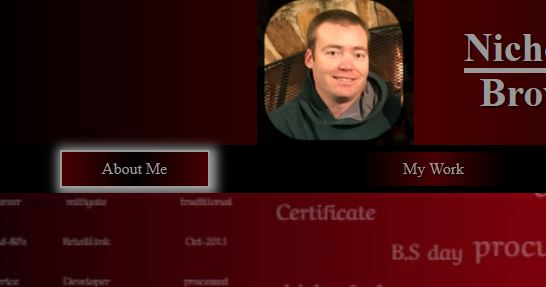
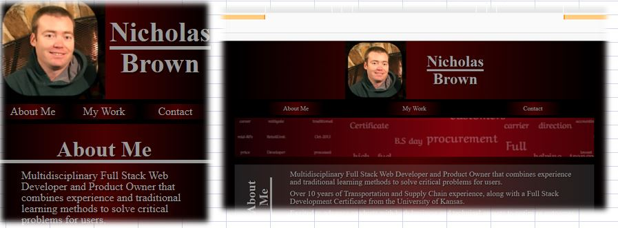

# Nicholas Brown Portfolio
## Link to Portfolio
https://brownnicholasj.github.io/nbrown_portfolio/
## Description
This portfolio page is to serve as a repository to showcase my work for both personal and professional projects.
- This will be a place I can store my work overtime to allow me to  track my skills and advancement
- Building this is the first phase of what will adjust and evolve along with my coding education.
- Having everything in one location allows me to easily recall, showcase, or sunset old works to allow them to serve multiple purposes over time.
- I think I learned not to get hung up on one part of the design/layout and to come back to it.  I wasted a lot of time on a background that delayed the overall completion of the webpage. If not getting sidetracked, I think completing the rest of the page would have helped me make decisions on the background.
## Table of Contents 
- [Outline](#outline)
- [Usage](#usage)
- [Credits](#credits)
## Outline
The portfolio page is setup as a one page design to highlight my work, with links to those pieces of work, when necessairy.  It gives users the ability to find/contact me.

I follow a pretty simple, yet accessible layout utilizing semantic tags  
'body' 
&ensp; 'header' 
&ensp; 'nav' 
&ensp; 'main' 
&ensp; &ensp;        'section' 
&ensp; &ensp; &ensp;            'h2' 
&ensp; &ensp; &ensp;            'article 
&ensp; &ensp;        'section' 
&ensp; &ensp; &ensp;            'h2' 
&ensp; &ensp; &ensp;            'article 
&ensp; &ensp; &ensp; &ensp;                'h3' 
&ensp; &ensp; &ensp;            'article 
&ensp; &ensp; &ensp; &ensp;                'h3' 
&ensp; &ensp; &ensp;            'article 
&ensp; &ensp; &ensp; &ensp;                'h3' 
&ensp; &ensp; &ensp;            'article 
&ensp; &ensp; &ensp; &ensp;                'h3' 
&ensp; &ensp; &ensp;            'article 
&ensp; &ensp; &ensp; &ensp;                'h3' 
&ensp; &ensp;        'section' 
&ensp; &ensp; &ensp;            'h2' 
&ensp; &ensp; &ensp;            'figure' 
&ensp; &ensp; &ensp;            'figure' 
&ensp; &ensp; &ensp;            'figure' 
&ensp; 'footer' 

## Usage
All links within the page will have a shadow upon hover to visibly show interaction ability.

  

Styled to mobile screen and increases using @media query.

  

I originally used a lot of grid to position my site, but I found it caused a lot more css code to setup and maintain, especially with media queries in place.  I switch a lot of it back to flexbox because it was simpler.  I like the control the grid gives me so eventually I might go back, but there are more functions/features that might work better for me in the future.
## Credits
One of the first things I did was add the footer and I wanted an 'updated date' feature so users would be able to tell the last time it was updated and/if the page is relevant with current work.

I found a JavaScript to do this, but this was before we started the JS classes, so in comments of html "Last modified script found via stackoverflow user: https://stackoverflow.com/users/2223187/dick-guertin"

